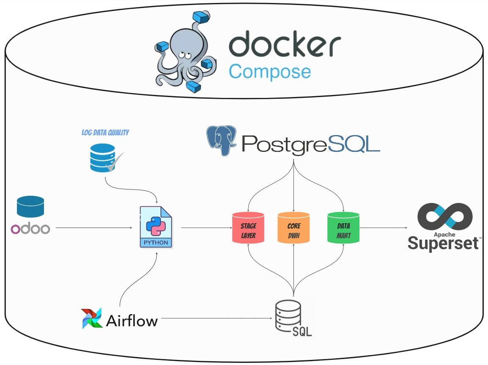
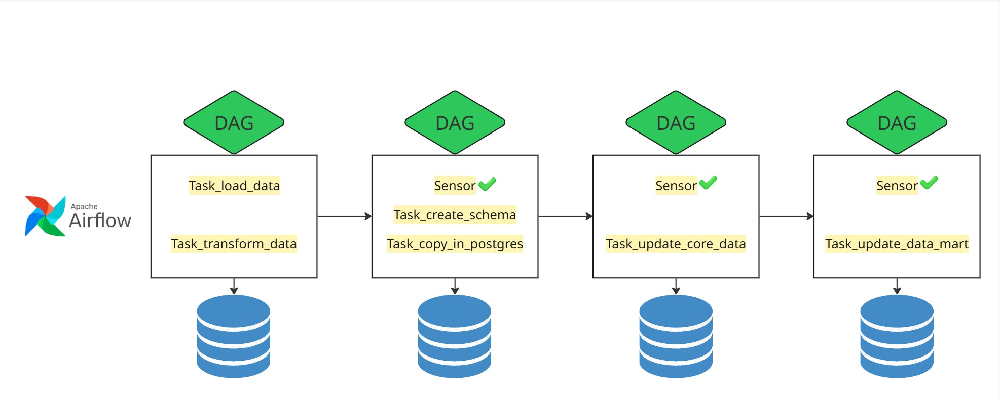

# AsmblDataWarehouse

Проект ProductionDashboard представляет собой решение, которое позволяет извлекать, трансформировать, загружать данные в базу данных и визуализировать их.

### 🔧 Используемые инструменты.  
- **Airflow** - оркестрация ETL процессов.   
- **Odoo** - источник данных.  
- **Python** - инструмент для трансформации.  
- **SQL** - инструмент для загрузки данных.  
- **PosgreSQL** - база данных.  
- **Apache Superset** - BI инструмент.  
- **Docker-compose** - для облегчения развертывания сервисов.   

### 📁 Структура проекта

```
.
├── dags/                # DAG.
├── images/              # Изображения.
├── tmp_data/            # Хранение xlsx и csv файлов.
├──.gitignore/           # Файлы, игнорируемые Git-ом.
├── docker-compose.yaml/ # Плагины Airflow.
├── download_dataset.py  # Скрипт загрузки датасета.
├── README.md/           # Информация о проекте.
└──  requirements.txt/   # Зависимости проекта.
```

### 🔨 Настройка
- Клонируем репозиторий.
- Поднимаем сервисы с помощю [docker-compose](docker-compose.yaml)
~~~
docker compose up
~~~
- В браузере переходим на http://localhost:8080
- Вводим логин и пароль (airflow, airflow)
- Настриваем коннектор.  
  Conn Id: postgres_dwh  
  Conn Type: postgres   
  Host: postgres_dwh    
  Port: 5432 
- В папке tmp_data лежит [dataset](/tmp_data/raw_data%20—%20копия.xlsx)
- Готово, теперь можно выставлять нужное время запуска DAG и база данных будет напоняться.
- Что бы подключиться к postgres:15  
  POSTGRES_USER: admin  
  POSTGRES_PASSWORD: admin  
  POSTGRES_DB: dwh_db  
  ports: 5433:5432  
- Настройка Apache Superset  
**Внутри контейнера выполняет следующую команду:**
~~~
docker exec -it asmbldatawarehouse-superset-1 superset fab create-admin \
            --username superset \
            --firstname Superset \
            --lastname Superset \
            --email admin@admin.com \
            --password superset
~~~
**Детали:**    
`docker exec:` Позволяет выполнить команду внутри существующего контейнера Docker.  
`-i` — интерактивный режим, позволяющей взаимодействовать с терминалом контейнера.  
`-t` — выделение псевдотерминала, обеспечивающего нормальный ввод-вывод данных.  
`asmbldatawarehouse-superset-1:` Название контейнера, в котором выполняется команда.  
`superset:` Основная команда для работы с инструментом Apache Superset.  
`fab:` Фабрика команд, предоставляющая административные инструменты для управления пользователями и ролями.  
`create-admin:` Специальная команда фабрики, предназначенная для создания нового администратора (суперпользователя).  
**Флаги и аргументы:**    
`--username superset:` Имя пользователя нового администратора.  
`--firstname Superset:` Имя администратора.  
`--lastname Superset:` Фамилия администратора.  
`--email admin@admin.com:` Электронная почта администратора.  
`--password superset:` Пароль для входа. 

####  Инициализации Apache Superset  
Эта команда производит обновление структуры базы данных до актуальной версии, соответствующей текущей версии Superset. Она выполняет миграции базы данных, гарантируя, что все требуемые таблицы и колонки существуют и согласованы с текущими требованиями Superset.
~~~
docker exec -it asmbldatawarehouse-superset-1 superset superset db upgrade
~~~

Данная команда первичную инициализацию Superset. Она создаёт начальные элементы (роли, группы, разрешения и проч.) и готовит среду к дальнейшему использованию.  
~~~
docker exec -it asmbldatawarehouse-superset-1 superset superset init
~~~

Устанавливаем Драйвер для SUPERSET в контейнер и перезапускаем его
~~~
pip install psycopg2-binary
~~~

Теперь можно пользоваться Apache Superset.

### 📚 Схема работы ETL: 


  1️⃣Запуск [download_dataset](/download_dataset.py): Загрузка данных с сайта.
  2️⃣Запуск [transform_file](dags/transform_file.py): Очистка, логирование.    
  3️⃣Запуск [insert_stage](dags/insert_stage.py): Загрузка raw_data в stage слой.   
  4️⃣Запуск [insert_core](dags/insert_core.py): Загрузка в core слой.
  5️⃣Запуск [insert_data_mart](dags/insert_data_mart.py): Загрузка в data_mart слой.

## 🔧 Конфигурация

### Порты и доступ
- Airflow - `http://localhost:8080` | User: airflow, Pass: airflow |
- Conn_Id - Postgres_dwh | Ports `5433:5432` | User: admin, Pass: admin, Database: dwh_db |  
- Superset - `http://localhost:80` | User: superset, Pass: superset |

