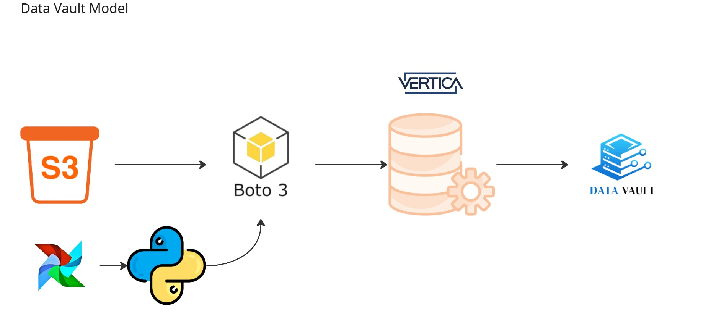
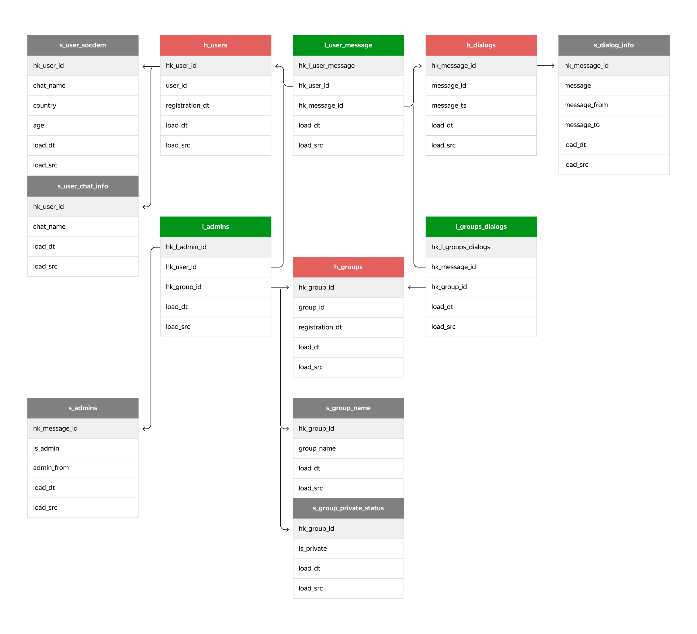
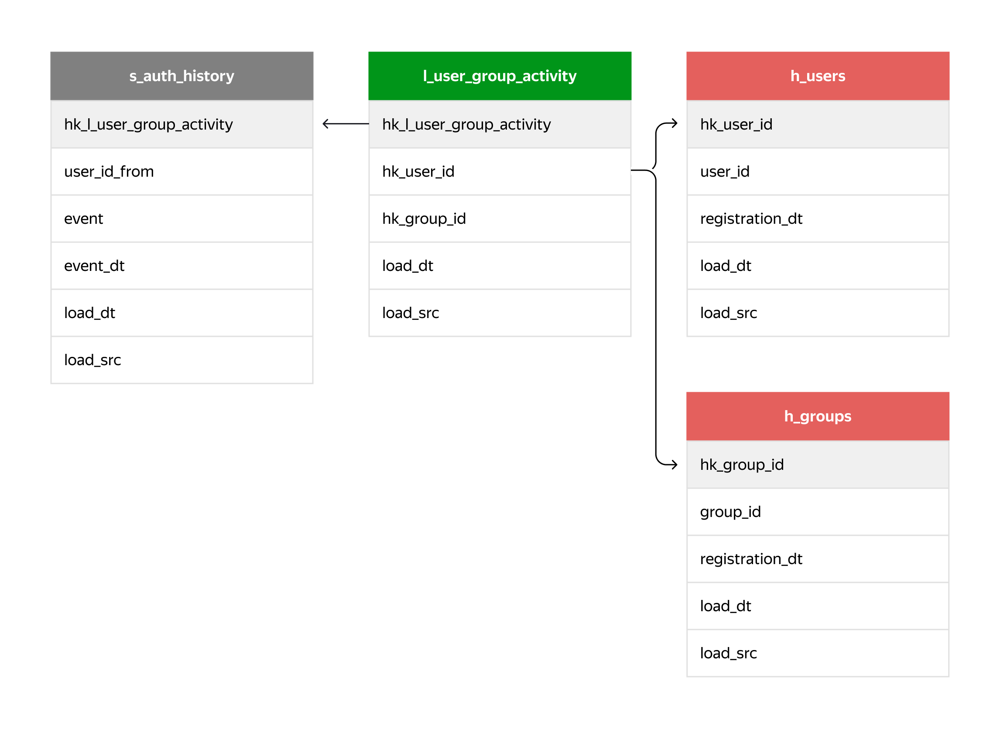
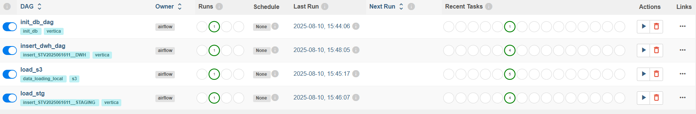
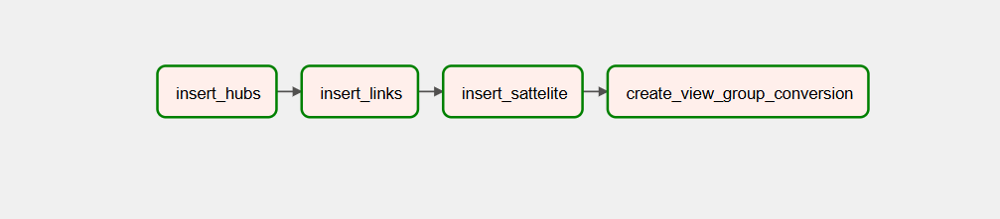

# AnalyticalDatabases

## О проекте
Проект включает в себя разработку схемы хранения данных в СУБД Vertica в соответствии с методологией Data Vault, а также реализацию и настройку ETL-процесса для автоматизированной загрузки данных из S3 с последующим распределением по соответствующим слоям данных средствами оркестрации Apache Airflow.

## 🗺️ Entity-Relationship Diagram

## 📈 Graph

## 📁 Структура проекта
~~~
.
├── dags                 # DAG.
├       ── lib           # Вспомогательные модули.
├       ── sql           # SQL скрипты.
├── data                 # Католог хранения csv файлов.
├── images/              # Изображения.
├──.dockerignore         # Файлы, игнорируемые Docker-ом.
├──.gitignore/           # Файлы, игнорируемые Git-ом.
├── docker-compose.yaml/ # Сервисы, необходимые для запуска проекта.
├── README.md/           # Информация о проекте.
└── requirements.txt/    # Зависимости проекта.
~~~

## 🔌 Доступные сервисы  
Airflow
~~~
Login: AirflowAdmin
Pass: airflow_pass
URL: http://localhost:3000/airflow
~~~
Vertica
~~~
Хост: vertica.tgcloudenv.ru
БД схема: dwh
Пользователь: stv2025061611
Пароль: G1A4LjhBsbp7363
Порт: 5433
~~~

## 🔨 Настройка проекта
1. Скопируйте проект в директорию
2. Запустите docker-compose.yaml
~~~
docker compose up -d
~~~
3. Настраиваем коннекторы в Airflow  
~~~
Connection Id: vertica_conn
Connection Type: Vertica
Description: pass
Host: vertica.tgcloudenv.ru
Schema: dwh
Login: stv2025061611
Password: G1A4LjhBsbp7363
Port: 5433
Extra: {"autocommit": true, "tlsmode": "disable"}
~~~
4. Создаем Переменные
~~~
AWS_ACCESS_KEY_ID: 
AWS_SECRET_ACCESS_KEY: 
bucket: sprint6
endpoint_url: https://storage.yandexcloud.net
service_name: s3
~~~
5. Готово можно запускать DAG для создания и заполнения таблиц данными  
Последовательность выполнения DAG:  
 **`init_db_dag`** - Инициализация таблиц в базе данных.  
 **`load_s3`** - Загрузка датасетов из S3-хранилища.  
 **`load_stg`** - Загрузка данных в staging-область.  
 **`insert_dwh_dag`** - Заполнение таблиц core и создание VIEW.  

Запускайте DAG в указанном порядке для корректной работы ETL-процесса.
