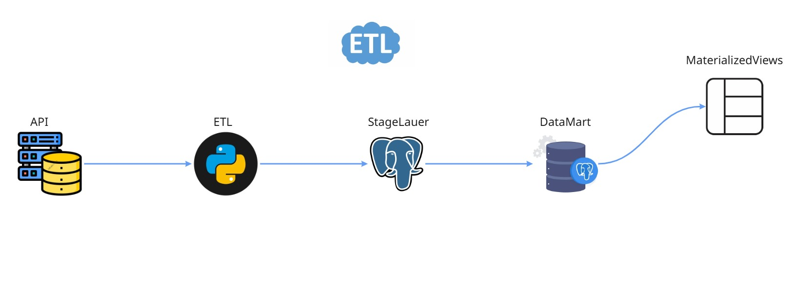
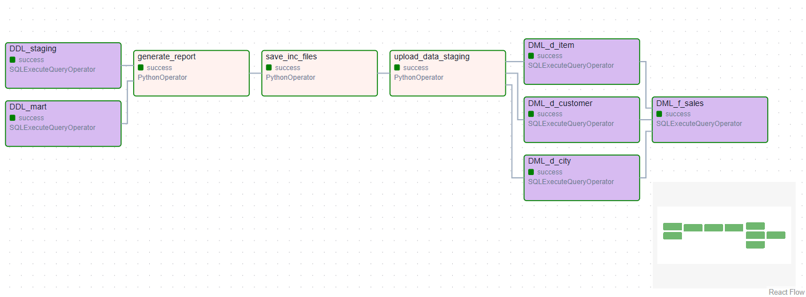
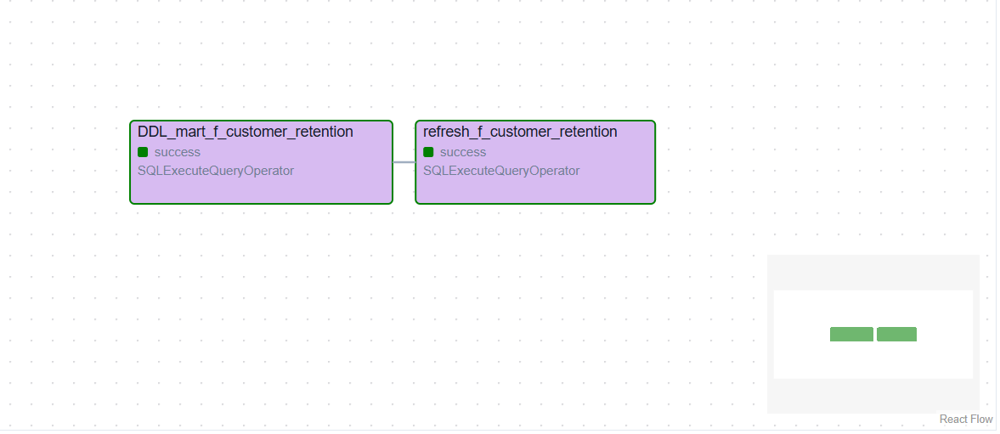
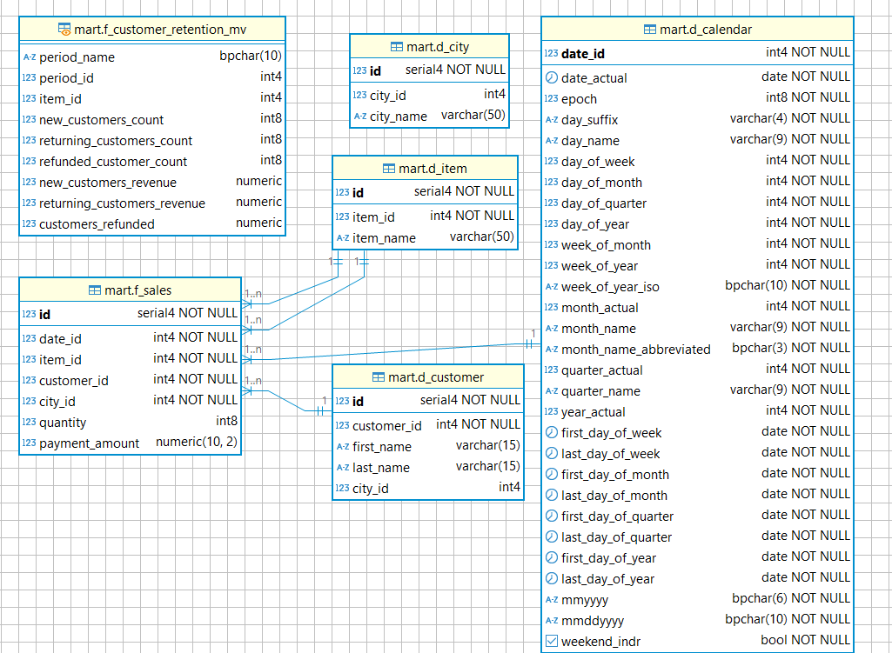

# EtlAirflowProject


#### 🧾 О проекте  
В данном проекте выполняется доработка пайплайна.
Есть исходный пайплайн, который уже работает и BI-аналитики строят графики по показателю total revenue для различных срезов.  
Но появилась новая вводная: команда разработки добавила функционал отмены заказов и возврата средств (refunded).
Также коллеги решили глубже изучить поведение клиентов. Для этого они хотят исследовать возвращаемость клиентов — customer retention.  
Выяснилось, что в текущем виде отчёт по customer retention строится очень долго.  
Коллеги попросили вас рассчитать необходимые метрики и сохранить их в дополнительной витрине.  

---

#### 📁 Структура проекта

```
.
├── dags/                # DAG.
├── images/              # Изображения.
├── tmp_data/            # Хранение csv файлов.
├──.gitignore/           # Файлы, игнорируемые Git-ом.
├── docker-compose.yaml/ # Сервисы, необходимые для запуска проекта.
├── download_dataset.py  # Скрипт загрузки датасета.
├── README.md/           # Информация о проекте.
└──  req.txt/            # Зависимости проекта.
```

#### 📈 Graph



#### 🗺️ Entity-Relationship Diagram


#### Доработки пайплайна  
✅ Учтены статусы shipped и refunded.
Код работает со старым форматом данных — без учёта статуса заказа.  
✅Создана витрина mart.f_customer_retention в виде materialized view, что позволяет один раз загрузить данные и обновлять их периодически.  

#### 🔌 Доступные сервисы  
🗄️ База данных (PostgreSQL)

    services: postgres_db
    POSTGRES_USER: postgres
    POSTGRES_PASSWORD: postgres
    POSTGRES_DB: sprint_etl_db
    ports (локальный → контейнер): 5430:5432  

🌐 Airflow Web UI

    User: airflow
    Pass: airflow
    ports (локальный → контейнер): 8070:8080

#### 🐳 Запуск и настройка  
- Поднять сервисы через `docker-compose`  
~~~
docker compose -p etl-project up -d
~~~
- Настроить подключение (Connections) в Airflow  
    Перейдите в веб-интерфейс Airflow по адресу:  
    http://localhost:8070  
    Войдите с учётными данными.   
    Перейдите в раздел Admin → Connections.  
    Создайте необходимые подключения, указав параметры доступа.  

- Добавить личную информацию в DAG  
Откройте DAG-файлы и укажите свои данные, где это требуется:  
    Ключ доступа.  
    Никнейм пользователя.  
    URL-адреса API.  
    Параметры расписания, если нужно изменить периодичность.


