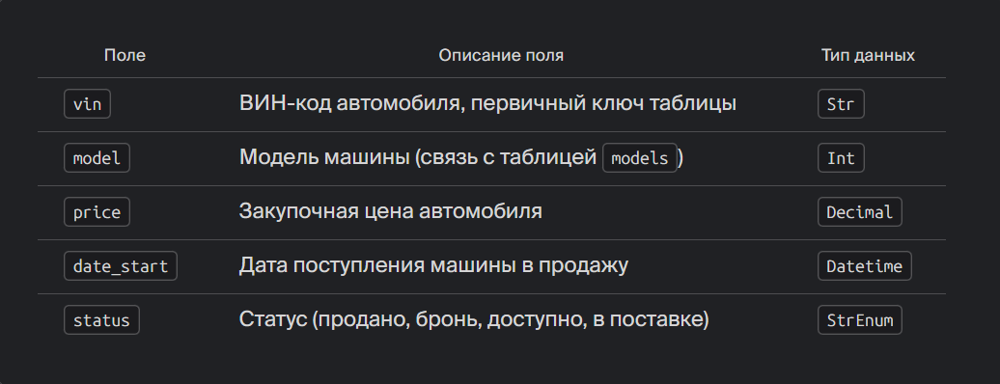
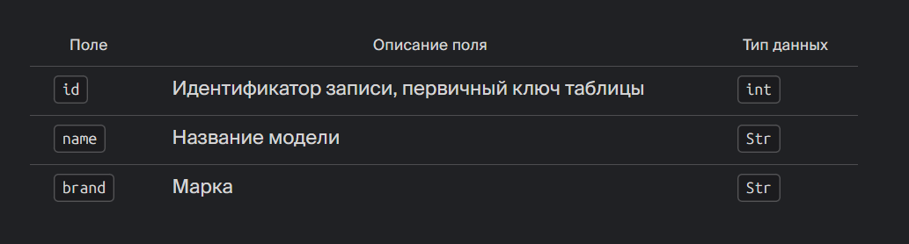
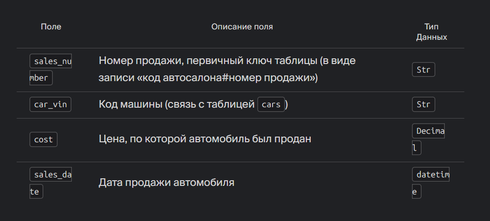

# IndexDatabase

## О проекте
Цель проекта.Создание упрощённой виртуальной системы управления базами данных (СУБД), способной взаимодействовать с внешними интерфейсами, записывать и считывать данные из текстовых файлов (txt). 

## Основные особенности  
Данные хранятся в простых текстовых файлах формата txt.Для оптимизации производительности чтения используются индексы, позволяющие получать необходимые записи напрямую, минуя чтение всего файла целиком.Файлы имеют небольшой размер, однако применение индекса позволяет ускорить доступ к данным.Стандартная библиотека Python не поддерживает возможность быстрого перехода к конкретной строке файла, кроме последовательного перебора всех предыдущих строк. Однако существует альтернативный подход, позволяющий эффективно решать данную проблему.
Для повышения производительности чтения больших файлов рекомендуется заранее зафиксировать длину каждой строки. Например, используя метод .ljust() с фиксированной длиной строки (например, 500 символов).
Это обеспечивает одинаковую длину всех записей, благодаря чему появляется возможность мгновенно переходить к нужной строке, зная её порядковый номер. Для этого применяется встроенный метод seek(). С помощью тестов подаются тестовые сценарии, а написанный класс и методы внутри него решают определённые задачи по выводу и записи информации в базу данных. 

## 📁 Структура проекта
```
.
├── images/              # Изображения. 
├── src/                 # Скрипты.
├── tests/               # pytest.
├──.gitignore/           # Файлы, игнорируемые Git-ом.
├── docker-compose.yaml/ # Сервисы.
├── dockerfile           # Докерфайл.
├── README.md/           # Информация о проекте.
└──  requirements.txt/   # Зависимости проекта.
```

## Настройка среды разработки
Рекомендуем использовать редактор [Visual Studio Code](https://code.visualstudio.com/).

vscode при запуске импортируем переменные среды из файла `.env` и запускаем отладку.

Чтобы в редакторе работала подсветка импортов, а при запуске все зависимости корректно подтягивались, создайте файл `.env` в корне проекта и добавьте в него следующие строки:
```bash
PYTHONPATH="$PYTHONPATH:full_path_to_src_folder_in_project"
```
где full_path_to_src_folder_in_project - полный путь до каталога src.

Этой командой вы добавляете каталог src в переменную окружения PYTHONPATH, чтобы python мог найти все модули в проекте.

После того, как вы создали файл `.env`, перезапустите vscode. Все импорты должны подсвечиваться корректно.

## Запуск тестов в консоли
Если вы хотите запустить тесты в консоли, вам так же нужно добавить переменную окружения PYTHONPATH. Для этого выполните следующие команды:
```bash
export PYTHONPATH=$PYTHONPATH:full_path_to_src_folder_in_project
```
где full_path_to_src_folder_in_project - полный путь до каталога src.

После этого вы можете запустить тесты:
```bash
cd de-project-bibip # переходим в каталог проекта
pytest tests # запускаем тесты
```

## Запуск проекта в докере
Для запуска в докере, вам нужно выполнить следующие команды:
```bash
cd de-project-bibip
docker compose up -d --build
```

После завершения работы остановите контейнер:
```bash
docker compose down -v
```

## Описание модели данных
Таблица `cars` хранит информацию о машинах.



Таблица `models` хранит справочник моделей машин.



Таблица `sales` хранит информацию о продаже машин.



## Основные функции
- Сохранение автомобилей и моделей.  
  Таким образом, при добавлении объекта, модели и машины, должны заполняться сразу оба файла. 
- Сохранение продаж.  
  Состоялась новая продажа, после которой производится запись о сделке с одновременным изменением статуса автомобиля.
- Вывод машин, доступных к продаже.  
  Другими словами, автомобиль переходит из состояния доступности (available) в другое статусное положение после продажи.
- Вывод детальной информации.  
  После ввода VIN-кода отображается следующая информация:   
    `VIN` — уникальный идентификационный номер автомобиля.     
    `Model Name` — марка модели автомобиля.  
    `Brand` — бренд производителя автомобиля (берётся из поля brand модели).  
    `Price` — первоначальная закупочная стоимость.  
    `Date Start` — дата начала продаж.  
    `Status` — текущий статус автомобиля.  
    `Sales Date` — дата продажи (или значение отсутствует, если автомобиль пока не продан).  
    `Sales Cost` — цена продажи (или значение отсутствует, если автомобиль пока не продан).  
- Обновление ключевого поля.  
  Функция, которая исправит VIN-код на корректный.
- Удаление продажи.  
  Функция, которая удаляет запись из таблицы продаж и заменяет статус для машины.
- Самые продаваемые модели  
  На главной странице приложения пользователь видит три самые популярные модели машин. 
